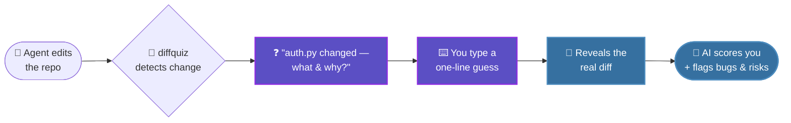

<div align="center">

<!-- ░░░ ANIMATED WAVING HEADER (renders automatically via capsule-render) ░░░ -->


<!-- ░░░ LIVE TYPING EFFECT (cycles through your taglines, animates automatically) ░░░ -->
<a href="https://github.com/Bravim-Ketan-Purohit/GIT-diff">
  
</a>

<br/>

<!-- ░░░ BADGES ░░░ -->
<p>
  <a href="https://github.com/Bravim-Ketan-Purohit/GIT-diff">
    
  </a>
  <a href="LICENSE">
    
  </a>
  
  <a href="CONTRIBUTING.md">
    
  </a>
</p>

<!-- ░░░ DEMO SLOT — the one thing you still record yourself ░░░ -->
<!-- Drop a terminal recording here (asciinema or a GIF). This is the #1 thing that earns stars. -->
<!--  -->

</div>


## 🧠 The problem

AI agents write code faster than you can read it. So you don't read it. You skim the green squares, hit accept, and three weeks later you can't answer basic questions about your own project — *what does this function return, where is this used, why is it built this way.*

> [!WARNING]
> **The danger isn't that the AI is wrong. It's that you stopped paying attention.**

`diffquiz` fixes that with one mechanic backed by learning science: **commit to a guess before you see the answer.** Before it reveals what your agent changed, it asks you to predict it. That single act of prediction is what turns passive skimming into actual understanding — and it catches bugs you'd otherwise wave through.


## ⚡ How it works



1. Run `diffquiz watch` in a split terminal pane next to your coding agent.
2. Your agent edits the repo. `diffquiz` notices the new changes.
3. **Before showing you the diff,** it asks: *"`auth.py` changed — what do you think changed, and why?"*
4. You type a one-line prediction.
5. It reveals the real diff, then (with an API key) scores your guess and **flags any bugs or risks it spots.**

You learn the codebase as it's being built, and you stop merging code you never read.


## 📦 Install

```bash
pip install diffquiz            # core
pip install "diffquiz[ai]"      # + AI scoring & risk flags (recommended)
```

## 🚀 Quickstart

```bash
# In your project, after your agent has made some changes:
diffquiz once

# Or run it live in a pane and get quizzed on every change:
diffquiz watch
```

<details>
<summary><b>🪟 Side-by-side with your agent (tmux)</b></summary>

<br/>

```bash
# main pane = your agent, right third = diffquiz
tmux new-session \; split-window -h -p 33 'diffquiz watch'
```

</details>

<details>
<summary><b>🤖 AI scoring (optional but worth it)</b></summary>

<br/>

```bash
export ANTHROPIC_API_KEY=sk-...          # unlocks grading + risk flags
export DIFFQUIZ_MODEL=claude-sonnet-4-6  # optional: sharper, slower than the default
```

> [!NOTE]
> Without a key, `diffquiz` still works — it shows the diff after your guess, just without the AI scorecard.

</details>


## 🔬 Why predict-first works

> [!TIP]
> Prediction before feedback is one of the most reliable learning mechanics there is: the moment of *being slightly wrong* is what makes the correction stick.

`diffquiz` weaponizes the 30 seconds you'd otherwise spend waiting for your agent — turning dead time into retention.


## 🗺️ Roadmap

- [ ] `docs/demo.gif` — record the first real session
- [ ] Untracked-file support (currently quizzes on tracked changes vs `HEAD`)
- [ ] Streak + score history (`~/.diffquiz/`)
- [ ] Spaced-repetition deck from past diffs
- [ ] Pluggable agents beyond git (watch a log, a webhook, etc.)
- [ ] A proper Textual TUI for the watch pane

Got an idea? [**Open an issue**](https://github.com/Bravim-Ketan-Purohit/GIT-diff/issues) — see [**CONTRIBUTING**](CONTRIBUTING.md).

## 🤝 Contributing

PRs are welcome. Whether it's a roadmap item, a bug fix, or just better docs — pick something up and open a pull request.

<details>
<summary><b>⭐ Star history</b></summary>

<br/>

<a href="https://star-history.com/#Bravim-Ketan-Purohit/GIT-diff&Date">
  
</a>

</details>

## 📄 License

MIT © [**Bravim Purohit**](https://github.com/Bravim-Ketan-Purohit)

<!-- ░░░ ANIMATED WAVING FOOTER ░░░ -->

